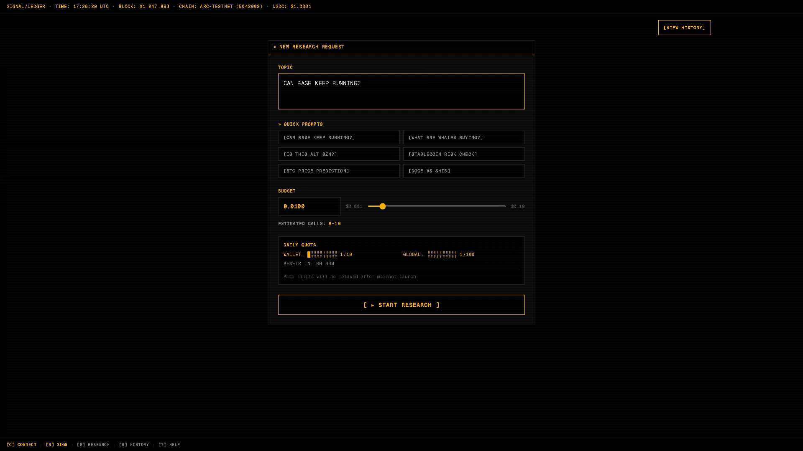
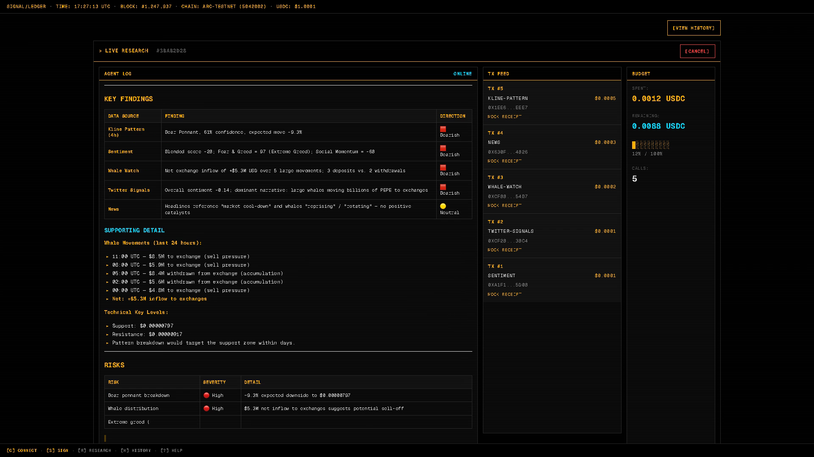
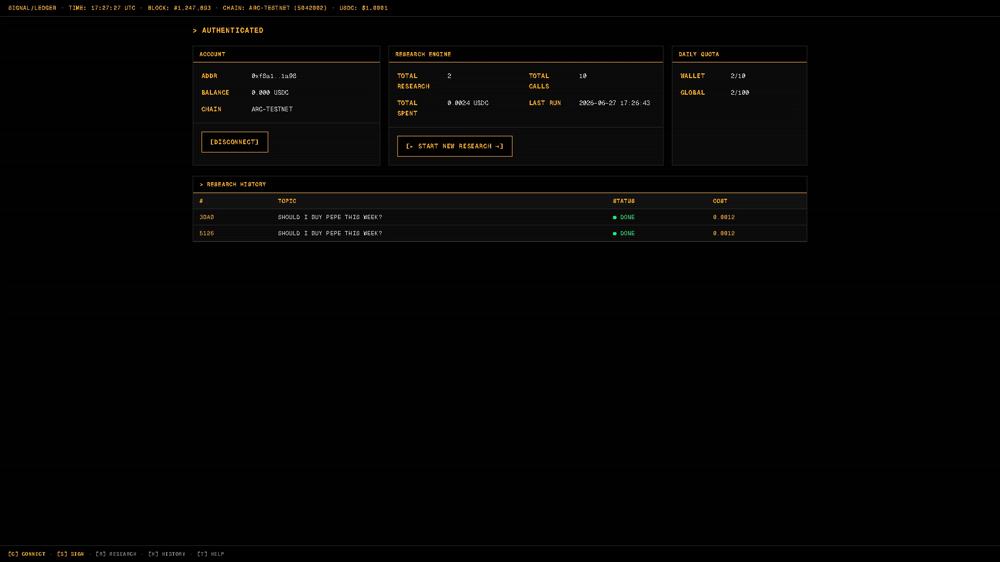
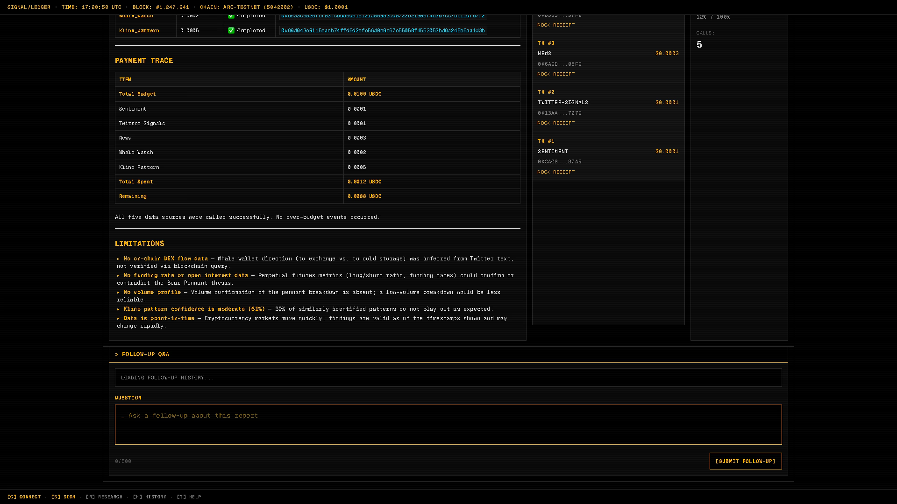

# SIGNAL/LEDGER

SIGNAL/LEDGER is an AI trading research terminal for crypto markets. A user connects a wallet, assigns a fixed USDC budget to a research agent, and lets the agent decide which paid data sources to call. The app produces a structured market research report and records every data-source call, budget movement, mock receipt, or ARC testnet receipt in an auditable ledger.

Recommended Vercel project slug: `signal-ledger`. If the slug is still available, the default production URL can be `https://signal-ledger.vercel.app/`.

> This project is built for research, demos, and testing payment-aware agent workflows. It is not investment advice.

## UI Tour

### New Research

The user enters a research topic, selects a budget, reviews wallet and global daily quotas, and starts a new research run.



### Live Research Stream

While a run is active, the frontend receives agent events over SSE. The main panel shows reasoning, tool calls, data findings, and report fragments. The right rail shows the payment feed and budget state.



### Account Overview And Research History

The dashboard shows wallet state, chain, balance, total research runs, paid calls, total spend, daily quotas, and historical research records.



### Report, Payment Trace, And Follow-up Q&A

The report detail page preserves data-source results, payment tracing, limitations, and follow-up Q&A. Users can ask focused follow-up questions about a completed report.



## Product Positioning

This project validates an end-to-end flow where an AI agent can behave like a budget-constrained buyer of market data:

- The user gives the agent a research topic and a USDC budget instead of asking the model to answer freely.
- The agent decides whether to call paid data sources, which ones to call, how much to spend, and when to stop.
- Each paid data-source call creates a payment intent and writes an entry into `tx_log`.
- Development mode can use `mock` receipts, so local demos do not require on-chain transactions.
- `arc` mode broadcasts a 0-value ARC testnet transaction and writes the JSON receipt into calldata.
- After a research run completes, multiple pending payment intents can be aggregated into one research settlement.
- Reports, transaction logs, budget state, and follow-up records can all be restored from the same wallet context.

## On-chain research escrow

The in-progress escrow rollout is documented in
[docs/contracts/onchain-research-escrow.md](docs/contracts/onchain-research-escrow.md). The runbook covers
the `3 + R` deployment topology, role boundaries, funding UX, worker SLA, deployment, rollback,
key rotation, incident response, and the Explorer/manifest evidence that must be filled from real
Arc Testnet deployment receipts before final evidence is published.
The final evidence entrypoint is now `deployments/5042002.json` for Arc Testnet chainId `5042002`
and clean commit `7141fae64465f44e4ebc2ce3648787e0b45c54fb`. The current manifest records
Registry `0x98c9ff2110843186f5fa55f5b0af010eca0bf0d3`, implementation
`0x0995d09b27681b02651de3936f46245832c5d712`, Factory
`0x352b064d831f1ee8a6005a186971011fa0c5f8dd`, and one funded/settled smoke clone
`0x00457075a5989da633410b1f7a92851313177a85`, so the current topology is `3 + R = 4`.

This manifest and the public RPC verifier are final local evidence inputs, but they do not by
themselves close the remaining external gates. Explorer exact-match source/ABI verification,
production rollout/E2E, and live rollback evidence must still be completed before the remaining
13.4 and 14.x completion items are marked or final publication is approved.

Deployment tooling and operators must not broadcast contract deployments, source configuration,
role changes, smoke transactions, or Explorer source verification without fresh stage-specific authorization
for the exact chain, commit, addresses, calldata/source payload, gas scope, and USDC impact.

## Core Capabilities

| Capability | Description |
| --- | --- |
| Wallet sign-in | Uses RainbowKit, wagmi, viem, and a SIWE-style signature to establish the `arc_session` cookie. |
| ARC network guard | Checks the connected wallet network and asks the user to switch to the configured ARC testnet chainId. |
| Research runs | Creates a research record from `topic` and `budgetUsdc`, then starts a live agent stream. |
| Live output | `/api/research/[id]/stream` pushes agent events with Server-Sent Events. |
| Budget constraint | The agent receives the budget and data-source prices in its system prompt. It currently uses at most 3 paid tools by default. |
| Metered data sources | Five mock data sources simulate whale flow, sentiment, news, Twitter signals, and 4h K-line patterns. |
| Payment ledger | Each call writes `source`, `amount`, `requestId`, `txStatus`, `txHash`, `chainId`, and `blockNumber` into `tx_log`. |
| ARC receipts | `ARC_RECEIPT_MODE=arc` broadcasts testnet receipts. `mock` mode writes local records only. |
| Async settlement | Pending intents from a completed research run can be aggregated into one `arc-lepton.research-settlement` transaction. |
| Follow-up Q&A | Completed reports support follow-up questions with persisted question, answer, status, and spend fields. |
| Daily quota | Wallet quota defaults to 10 runs per UTC day. Global quota defaults to 100 runs per UTC day. |
| Storage fallback | When Postgres or Redis is not configured, development uses in-memory repositories and in-memory KV. |

## Tech Stack

| Layer | Choice |
| --- | --- |
| Web framework | Next.js 14 App Router |
| UI | React 18, Tailwind CSS, custom terminal-style components |
| Wallet | RainbowKit, wagmi, viem |
| Auth | SIWE-style message, JWT, HttpOnly session cookie |
| LLM | OpenAI SDK compatible client, DeepSeek by default |
| Database | Vercel Postgres, Drizzle ORM, Drizzle Kit |
| KV and rate limits | Upstash Redis REST, with an in-memory fallback when unset |
| Tests | Vitest, Testing Library, jsdom |
| On-chain receipts | ARC testnet RPC, viem wallet client |

## Repository Layout

```text
app/
|-- page.tsx                         # Home page and global stats
|-- dashboard/page.tsx                # Wallet overview and research history
|-- research/page.tsx                 # New research and live research page
|-- research/[id]/page.tsx            # Research report detail page
|-- api/auth/*                        # nonce, verify, session, logout
|-- api/research/*                    # create, read, stream, cancel, follow-ups
|-- api/data/[name]/route.ts          # Paid mock data sources
|-- api/quota/route.ts                # Wallet and global daily quotas
`-- api/wallet/*                      # Wallet stats and transaction log

components/
|-- auth/                             # Wallet connect, network guard, auth gate
|-- research/                         # Agent log, budget meter, TX feed, Markdown rendering
|-- BottomBar.tsx                     # Bottom shortcut hint bar
|-- Logo.tsx
`-- TopBar.tsx

lib/
|-- agent/                            # Research agent, event bus, follow-up logic
|-- auth/                             # JWT, session, nonce, SIWE validation
|-- chain/                            # ARC receipt construction and broadcasting
|-- data/                             # Deterministic mock data sources
|-- db/                               # Repo interfaces, PG repos, memory repos, schema
|-- llm/                              # DeepSeek/OpenAI-compatible client
|-- rate-limit/                       # Research daily quotas
|-- stats/                            # Global stats
`-- x402/                             # Payment middleware, receipts, settlement

docs/plans/                           # Design docs and implementation plans
drizzle/                              # Drizzle-generated migration files
test/fixtures/                        # Wallet and SIWE test fixtures
```

## Quick Start

### 1. Install dependencies

pnpm is recommended. CI currently validates with pnpm 10.14.0.

```bash
pnpm install
```

### 2. Create local environment variables

```bash
cp .env.example .env.local
```

Recommended minimum values:

```bash
NEXT_PUBLIC_APP_URL=http://localhost:3000
NEXT_PUBLIC_WALLETCONNECT_PROJECT_ID=your-walletconnect-project-id
NEXT_PUBLIC_ARC_CHAIN_ID=5042002
NEXT_PUBLIC_ARC_RPC_URL=your-arc-testnet-rpc
NEXT_PUBLIC_ARC_EXPLORER_URL=your-arc-explorer-url
JWT_SECRET=a-random-secret-with-at-least-32-characters
ARC_RECEIPT_MODE=mock
DEEPSEEK_API_KEY=your-deepseek-api-key
```

Generate a local `JWT_SECRET` with:

```bash
openssl rand -base64 32
```

### 3. Choose a storage mode

#### Fastest demo: in-memory mode

If you only want to run the UI and basic flow, leave `DATABASE_URL`, `POSTGRES_URL`, `KV_REST_API_URL`, and `KV_REST_API_TOKEN` empty. The app will use in-memory repositories and in-memory KV.

Important: in-memory data is lost when the process restarts. This mode is not suitable for production or shared testing.

#### Persistent testing: Postgres + Redis

To keep users, research records, transaction logs, and follow-up history, configure:

```bash
DATABASE_URL=postgres://...
KV_REST_API_URL=https://...
KV_REST_API_TOKEN=...
```

If Vercel or Upstash injects alternative names, these are also supported:

```bash
POSTGRES_URL=postgres://...
UPSTASH_REDIS_REST_URL=https://...
UPSTASH_REDIS_REST_TOKEN=...
```

After configuring the database, push the schema:

```bash
pnpm db:push
```

### 4. Start the development server

```bash
pnpm dev
```

The default URL is `http://localhost:3000`.

Recommended paths to check:

- `/`: home page and global stats.
- `/login`: wallet connection and signature sign-in.
- `/dashboard`: account, research engine state, quotas, and research history.
- `/research`: new research and live agent stream.
- `/research/[id]`: completed report detail and follow-up Q&A.

### 5. Run verification

```bash
pnpm typecheck
pnpm test --run
pnpm build
```

pnpm 9 is stricter about forwarding Vitest arguments. If arguments are not forwarded, use:

```bash
pnpm test -- --run
```

## Environment Variables

### Public variables

| Variable | Required | Description |
| --- | --- | --- |
| `NEXT_PUBLIC_APP_URL` | Recommended | Public app URL. The SIWE message domain and URI depend on it. Defaults to `http://localhost:3000` in development. |
| `NEXT_PUBLIC_WALLETCONNECT_PROJECT_ID` | Recommended | WalletConnect projectId. A development fallback exists, but production should use a real projectId. |
| `NEXT_PUBLIC_ARC_CHAIN_ID` | Yes | ARC testnet chainId. Used by the network guard, SIWE validation, and viem chain config. |
| `NEXT_PUBLIC_ARC_RPC_URL` | Yes | ARC testnet RPC. Used for wallet balance reads and on-chain receipt broadcasting. |
| `NEXT_PUBLIC_ARC_EXPLORER_URL` | Optional | Explorer base URL for transaction hash links. |

### Server-only sensitive variables

| Variable | Required | Description |
| --- | --- | --- |
| `JWT_SECRET` | Yes | JWT signing secret. Must be at least 32 characters. Sign-in, research tokens, and protected APIs fail without it. |
| `DATABASE_URL` | Recommended | Postgres connection string. When configured, Drizzle repositories use Postgres implementations. |
| `POSTGRES_URL` | Optional | Common Vercel Postgres variable. Either `DATABASE_URL` or `POSTGRES_URL` is enough. |
| `KV_REST_API_URL` | Recommended | Upstash Redis REST URL for nonces, rate limits, and quota counters. |
| `KV_REST_API_TOKEN` | Recommended | Upstash Redis REST token. |
| `UPSTASH_REDIS_REST_URL` | Optional | Upstash-injected alias. The code reads it as a fallback. |
| `UPSTASH_REDIS_REST_TOKEN` | Optional | Upstash-injected alias. The code reads it as a fallback. |
| `DEEPSEEK_API_KEY` | Required in production | Used by the research agent and follow-up Q&A. Production throws if it is missing. |
| `DEEPSEEK_BASE_URL` | Optional | Defaults to `https://api.deepseek.com/v1`. |
| `DEEPSEEK_MODEL` | Optional | Defaults to `deepseek-v4-flash`. |
| `ARC_RECEIPT_MODE` | Recommended | `mock` or `arc`. Defaults to mock behavior. |
| `ARC_RECORDER_PRIVATE_KEY` | Required for arc mode | Server-side recorder wallet private key for broadcasting ARC receipts. Never put this in `NEXT_PUBLIC_*`. |
| `ARC_RECEIPT_TO_ADDRESS` | Optional | Receipt transaction recipient. If empty, the recorder sends to itself. |

## ARC Receipt Modes

### mock mode

```bash
ARC_RECEIPT_MODE=mock
```

Use this for local development and UI demos:

- No on-chain transaction is broadcast.
- Each paid data-source call still writes a `tx_log` entry.
- `txStatus` is `mock`.
- `ARC_RECORDER_PRIVATE_KEY` is not required.

### arc mode

```bash
ARC_RECEIPT_MODE=arc
ARC_RECORDER_PRIVATE_KEY=0x...
ARC_RECEIPT_TO_ADDRESS=0x...
```

Use this for testing real ARC receipts:

- Direct calls to `/api/data/*` paid APIs broadcast a 0-value ARC testnet transaction.
- The receipt payload is written into calldata.
- The recorder wallet must have ARC testnet gas.
- Missing `NEXT_PUBLIC_ARC_CHAIN_ID`, `NEXT_PUBLIC_ARC_RPC_URL`, or recorder private key returns a configuration error.
- The system does not fake a confirmed state. Broadcast failure is recorded as `failed` or returned as an error.

In arc mode, direct paid API calls must include an idempotency key:

```bash
Idempotency-Key: research-demo-001
```

Also supported:

- `X-Idempotency-Key` header.
- `requestId` query parameter.

Idempotency key rules:

- Length must be 1 to 128 characters.
- Allowed characters are `[A-Za-z0-9._:-]`.
- Reusing the same key for the same address and payment scope reuses the existing receipt.
- Reusing the same key for a different scope under the same address returns a conflict.

## Data Sources And Prices

Agent tools are defined in `lib/agent/research-agent.ts` and `lib/data/mock-sources.ts`.

| Data source | API source | Price per call | Returned data |
| --- | --- | --- | --- |
| Whale Watch | `whale-watch` | `0.0002` USDC | Large transfers, direction, and net inflow/outflow. |
| Sentiment | `sentiment` | `0.0001` USDC | Fear and greed, social momentum, technical signal, and aggregate trend. |
| News | `news` | `0.0003` USDC | Recent market headlines, sources, timestamps, and sentiment scores. |
| Twitter Signals | `twitter-signals` | `0.0001` USDC | Simulated tweets, engagement, and overall social sentiment. |
| Kline Pattern | `kline-pattern` | `0.0005` USDC | 4h candlestick pattern, confidence, expected direction, support, and resistance. |

The mock data sources are deterministic rather than random noise. They seed data from `source + token + currentDay`, so the same token and data source are stable within the same UTC day. This makes demos and tests repeatable.

## Research Lifecycle

A full research run follows roughly 9 steps:

1. The user enters `topic` and `budgetUsdc` on `/research`.
2. The frontend calls `POST /api/research/start`.
3. The server validates `arc_session` with `requireAuth`.
4. `consumeQuota(address)` consumes wallet and global daily quota.
5. `researchRepo.create` creates a `running` research record.
6. The frontend connects to `GET /api/research/[id]/stream`.
7. The SSE route competes for `claimResearchRunner(researchId)` so only one runner executes a given research run.
8. `runResearchAgent` calls the LLM, decides which data sources to use based on budget and prices, and publishes events.
9. The terminal event persists the report, spend, and status. The frontend shows the full report, TX feed, and follow-up form.

SSE event types:

| Type | Purpose |
| --- | --- |
| `thinking` | Agent progress or stage notes. |
| `tool_call` | Data-source name and arguments before execution. |
| `tool_result` | Data-source preview and payment state. |
| `budget` | Current spend and remaining budget. |
| `report_chunk` | Streaming report fragment. |
| `final` | Complete Markdown report, total spend, and call count. |
| `error` | Failure or cancellation reason. |

## Payment And Settlement Flow

Direct data-source calls and agent-internal tool calls use the same payment record model:

```text
User wallet
  |
Protected API requireAuth
  |
Paid data source withPayment or agent tool execution
  |
recordPaymentReceipt / recordResearchPaymentIntent
  |
tx_log writes source, amount, requestId, txStatus
  |
mock receipt or ARC receipt
  |
settleResearchPayments aggregates pending intents after research completion
  |
payment_settlement records the aggregate transaction and final state
```

Important states:

| State | Meaning |
| --- | --- |
| `mock` | Local development receipt. No on-chain transaction was broadcast. |
| `pending` | Payment intent was recorded and is waiting for research settlement. |
| `confirmed` | ARC receipt or aggregate settlement was confirmed. |
| `failed` | Broadcast, confirmation, or persistence failed. The error reason is retained. |

Settlement failure does not roll back a completed report. The report remains readable, and the TX feed plus detail page display the real state: `pending settlement`, `confirmed`, `failed`, or `mock receipt`. Later compensation jobs can retry from `payment_settlement` and pending `tx_log` records.

## Auth Flow

Auth starts in `components/auth/ConnectWalletButton.tsx` and `app/api/auth/*`:

1. The frontend calls `GET /api/auth/nonce`.
2. The server stores the nonce in KV with a 5-minute TTL.
3. The wallet signs a SIWE-style message.
4. The frontend submits `POST /api/auth/verify`.
5. The server validates domain, chainId, issuedAt, nonce, and signature.
6. On success, `usersRepo.upsertOnLogin` inserts or updates the user.
7. The server signs a JWT and returns it as the `arc_session` HttpOnly cookie.
8. Protected APIs call `requireAuth(req)` to read and verify the cookie.

Limits:

- Session cookie name: `arc_session`.
- Session lifetime: 7 days.
- Nonce TTL: 5 minutes.
- SIWE issuedAt max age: 5 minutes.
- Nonce API rate limit: 120 requests per IP per minute.
- Verify API rate limit: 30 requests per IP per minute.

## Database Model

The project uses Drizzle schema files to manage Postgres tables:

| Table | Purpose |
| --- | --- |
| `users` | Wallet users that signed in. |
| `research` | Research topic, budget, spend, status, report, and error message. |
| `tx_log` | Payment ledger for data-source calls and receipts. |
| `payment_settlement` | Aggregate settlement for multiple pending intents within one research run. |
| `research_follow_up` | Follow-up questions, answers, status, and spend. |

Common commands:

```bash
pnpm db:generate
pnpm db:push
```

The current `pnpm db:push` syncs:

- `tx_log.request_id`.
- `tx_log.settlement_id`.
- Unique constraint on `tx_log(address, request_id)`.
- `payment_settlement` table.
- `research_follow_up` table.

## API Reference

### Auth

| Method | Path | Description |
| --- | --- | --- |
| `GET` | `/api/auth/nonce` | Create a login nonce. |
| `POST` | `/api/auth/verify` | Verify wallet signature and set `arc_session`. |
| `GET` | `/api/auth/session` | Read the current session. |
| `POST` | `/api/auth/logout` | Clear the session cookie. |

### Research

| Method | Path | Description |
| --- | --- | --- |
| `POST` | `/api/research/start` | Create a research run after validating body, auth, and daily quota. |
| `GET` | `/api/research` | Return the current wallet's research list. |
| `GET` | `/api/research/[id]` | Return one research run and related tx log entries. |
| `GET` | `/api/research/[id]/stream` | Run or subscribe to research events over SSE. |
| `POST` | `/api/research/[id]/cancel` | Cancel a running research run. |
| `GET` | `/api/research/[id]/follow-ups` | Read report follow-up records. |
| `POST` | `/api/research/[id]/follow-ups` | Submit a new follow-up question. |

`POST /api/research/start` body:

```json
{
  "topic": "Should I buy PEPE this week?",
  "budgetUsdc": "0.0100"
}
```

Constraints:

- `topic`: 1 to 200 characters.
- `budgetUsdc`: string format with up to 8 decimal places.
- `budgetUsdc` range: `0.001` to `1`.

### Data Sources

| Method | Path | Description |
| --- | --- | --- |
| `GET` | `/api/data/whale-watch?token=PEPE` | Paid whale-flow data. |
| `GET` | `/api/data/sentiment?token=PEPE` | Paid sentiment data. |
| `GET` | `/api/data/news?token=PEPE` | Paid news data. |
| `GET` | `/api/data/twitter-signals?token=PEPE` | Paid social-signal data. |
| `GET` | `/api/data/kline-pattern?token=PEPE` | Paid K-line pattern data. |

Direct calls to these APIs require an authenticated session. In arc mode, they also require an idempotency key.

### Quota, Stats, And Wallet

| Method | Path | Description |
| --- | --- | --- |
| `GET` | `/api/quota` | Current wallet quota and global quota. |
| `GET` | `/api/stats/global` | Global research count, call count, total spend, and active agents. |
| `GET` | `/api/wallet/stats` | Current wallet stats. |
| `GET` | `/api/wallet/tx-log` | Current wallet's latest 50 transaction log entries. |

## Local Development Notes

### Recommended development startup order

```bash
pnpm install
cp .env.example .env.local
pnpm db:push
pnpm dev
```

If no database is available, skip `pnpm db:push` and use in-memory repositories. Refresh and hot reload can still work, but process restarts lose data.

### Useful debugging paths

- Sign-in failure: inspect `/api/auth/verify` response and server-side SIWE diagnostics.
- Research cannot start: check `JWT_SECRET`, session cookie, daily quota, and request body.
- SSE has no output: verify `/api/research/[id]/stream` returns `text/event-stream`.
- Data-source failure: check `DEEPSEEK_API_KEY`, budget, mock data-source name, and payment state.
- Receipt failure: check `ARC_RECEIPT_MODE`, RPC, chainId, recorder private key, and testnet gas.
- TX feed is stale: inspect `tx_log`, `payment_settlement`, and pending settlement state.

### Code style

- User communication, documentation, code comments, and logs are normally written in Chinese in this project. This README is English because the user explicitly requested an English version.
- Code identifiers and configuration keys are written in English.
- New features and behavior changes follow OpenSpec. Bug fixes and documentation-only updates can skip proposals.
- Implementation changes follow TDD, then finish with typecheck, tests, and build verification.

## Deploying To Vercel

1. Create or link a Vercel project. Recommended slug: `signal-ledger`.
2. Attach Vercel Postgres or provide `DATABASE_URL`/`POSTGRES_URL`.
3. Attach Upstash Redis or provide KV REST variables.
4. Configure WalletConnect projectId, ARC chainId, RPC, and explorer.
5. Configure `JWT_SECRET` and `DEEPSEEK_API_KEY`.
6. Run `pnpm db:push` locally or in CI to sync the database schema.
7. Run before deployment:

```bash
pnpm typecheck
pnpm test --run
pnpm build
```

Production recommendations:

- Do not use in-memory DB or in-memory KV.
- Keep `ARC_RECORDER_PRIVATE_KEY` in server-side environment variables only.
- Never put private keys in `NEXT_PUBLIC_*`.
- Use a real WalletConnect projectId.
- `NEXT_PUBLIC_APP_URL` must match the production domain, or SIWE domain validation will fail.

## Troubleshooting

### Wallet connects, but signature sign-in fails

Check:

- Whether `NEXT_PUBLIC_APP_URL` matches the browser URL.
- Whether `NEXT_PUBLIC_ARC_CHAIN_ID` matches the connected wallet network.
- Whether the signed message's `Chain ID`, `URI`, and `Issued At` are within the allowed window.
- Whether `JWT_SECRET` exists and is at least 32 characters long.

In development, `/api/auth/verify` prints SIWE diagnostics on the server. The diagnostic object includes parsed and expected fields.

### Research start returns 429

The daily quota has been reached:

- Wallet quota: 10 runs per UTC day by default.
- Global quota: 100 runs per UTC day by default.

Quota counters are stored in KV. If local development uses in-memory KV, restarting the dev server clears the counters.

### `pnpm db:push` fails

Check:

- Whether `DATABASE_URL` or `POSTGRES_URL` is configured.
- Whether the database allows connections from the current network.
- Whether the connection string requires SSL parameters.
- Whether the target database user can create tables and indexes.

For a local demo, you can skip the database push and use in-memory mode.

### pnpm returns `packages field missing or empty`

If local commands such as `pnpm --version`, `pnpm typecheck`, or `pnpm test --run` immediately return:

```text
ERROR packages field missing or empty
```

The pnpm workspace config currently being read is missing a `packages` field. You can verify with local binaries first:

```bash
./node_modules/.bin/tsc --noEmit
./node_modules/.bin/vitest run
```

To restore the pnpm workflow, add the missing workspace `packages` configuration and rerun the pnpm commands.

### The research stream shows `DEEPSEEK_API_KEY required in production`

Production requires `DEEPSEEK_API_KEY`. Development can use mock or test paths for some flows, but the real research agent and follow-up Q&A still require a working LLM key.

### arc mode returns `IDEMPOTENCY_KEY_REQUIRED`

Direct calls to `/api/data/*` paid APIs must include an idempotency key in arc mode:

```bash
curl "http://localhost:3000/api/data/sentiment?token=PEPE" \
  -H "Cookie: arc_session=..." \
  -H "Idempotency-Key: demo-sentiment-001"
```

### arc receipt broadcasting fails

Check:

- Whether `NEXT_PUBLIC_ARC_RPC_URL` is reachable.
- Whether `NEXT_PUBLIC_ARC_CHAIN_ID` is correct.
- Whether `ARC_RECORDER_PRIVATE_KEY` is a valid `0x`-prefixed private key.
- Whether the recorder address has testnet gas.
- Whether `ARC_RECEIPT_TO_ADDRESS` is a valid address.

## Design Materials

- Auth module design: `docs/plans/2026-06-23-auth-module-design.md`
- Auth module plan: `docs/plans/2026-06-23-auth-module-plan.md`
- Visual mockup v0: `docs/plans/2026-06-23-auth-mockup-v0.html`
- Visual mockup v1: `docs/plans/2026-06-23-auth-mockup-v1.html`
- Research agent plan: `docs/plans/2026-06-25-research-agent-engine-plan.md`
- Research web UI plan: `docs/plans/2026-06-25-research-web-ui-plan.md`
- x402 mock data plan: `docs/plans/2026-06-25-x402-mock-data-plan.md`
- ARC receipt plan: `docs/plans/2026-06-26-real-arc-payment-receipts.md`
- Async batched payment receipt plan: `docs/plans/2026-07-03-async-batched-payment-receipts-implementation-plan.md`

## Verification Checklist

Before submitting, confirm:

- `pnpm typecheck` passes.
- `pnpm test --run` passes.
- `pnpm build` passes.
- README screenshot paths exist.
- `.env.local` is not committed.
- If database schema changed, `pnpm db:push` has run or a migration has been generated.
